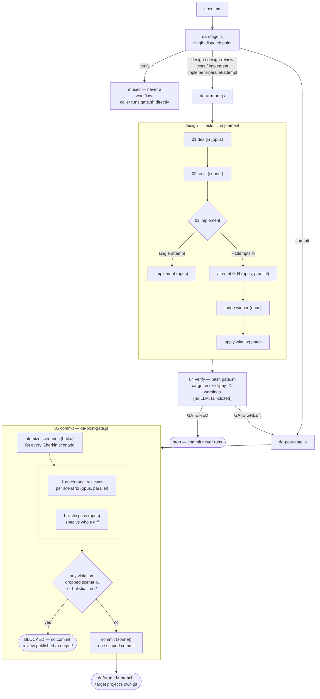

# da-run

**A staged Rust code factory for Claude Code — spec in, verified + committed change out.**

```sh
unzip da-run-skill.zip -d ~/.claude/skills/
```

## The problem

Ask an agent to "implement X" in one shot and you get one shot's worth of judgment: design,
tests, and code all invented in the same breath, reviewed by nobody, landed on `main` before
you've read the diff. It's fast, and it's exactly how silent regressions get shipped.

## The solution

da-run turns "implement X" into five separate, inspectable stages — **design → tests → implement
→ verify → commit** — each with its own model, its own contract, and its own `output/` folder you
can read or edit before the next stage runs. Tests are written before code exists. The gate is a
plain shell script, not an LLM's opinion, and it must go green before anything ships. A change
only becomes a commit after an adversarial reviewer independently checks it against every
Gherkin scenario in the spec. The result lands on its own branch — never on `main`, never pushed
— for you to merge when you're ready.

## Why use it?

| | One-shot prompting | da-run |
|---|---|---|
| Design reviewed before code is written? | No | Yes — stage 1 output, readable, editable |
| Tests exist before implementation? | Rarely | Always — TDD is stage 2, before stage 3 |
| Ship gate | "looks right" | `cargo test` + `clippy -D warnings` (deterministic, fail-closed) |
| Pre-commit review | None | Adversarial pass, one verdict per Gherkin scenario |
| Where the change lands | Wherever you were | Its own `da/<run-id>` branch, untouched `main` |
| Mid-run steering | Start over | Edit any stage's `output/` file, re-run from there |

## Quick example

```sh
# One shot at the whole pipeline, stopping at the first red stage:
/da-run all ./change-spec.md

# Or drive it stage by stage, inspecting each handoff:
/da-run design ./change-spec.md
# ... read stages/01-design/output/, edit it if the design's wrong ...
/da-run tests ./change-spec.md
/da-run implement ./change-spec.md
/da-run verify ./change-spec.md          # the mechanical gate — no LLM in this step
/da-run commit ./change-spec.md          # adversarial review, then one scoped commit

# Or try three independent implementation attempts and let a judge pick the best:
/da-run implement-parallel-attempt ./change-spec.md --attempts 3
```

Every stage refuses to run out of order — `tests` before a design exists, `commit` before the
gate is green — with a one-line explanation instead of silently doing the wrong thing.

`change-spec.md` above is any frozen spec in your own format. For a worked, full-length example —
including the messy problem statement and elicitation exchange that produced it — see
[`example-feature-spec.md`](example-feature-spec.md) and its companion
[`example-spec-prompt.md`](example-spec-prompt.md).

## Design philosophy

- **The folder is the algorithm.** There's no framework or hidden state machine — `CLAUDE.md`,
  `CONTEXT.md`, and `stages/*/CONTEXT.md` are the entire spec. Read the right file at the right
  moment; a stage is done when its `output/` has files in it.
- **Nothing advances on "looks right."** Each stage has an Audit. The gate is a shell script with
  an exit code, not a model's self-assessment.
- **The gate stays mechanical.** `04-verify` is never a workflow and never an agent — it's
  `cargo test` + `cargo clippy -D warnings`, plus two optional deepeners (`hex-lint`,
  `effect-audit`) that report a loud SKIP when missing, never a silent pass.
- **A project can own its own bar.** Ship an executable `.da/gate` at your project root and the
  dispatcher runs that instead of the generic chain — fails closed if it exists but isn't
  executable, so a broken gate can't silently downgrade to the default.
- **Load only what the stage names.** Design reads the spec and `architecture.md`; implement
  reads the design and tests, not the spec's prose. Loading more context makes the output worse.

## Installation

```sh
# personal — available to all projects
unzip da-run-skill.zip -d ~/.claude/skills/

# per-project — available only inside this repo
unzip da-run-skill.zip -d <project>/.claude/skills/
```

Requires [babashka](https://babashka.org) (`bb`) and `git` on `PATH`. The target project must be
a git repository with a clean working tree — the driver refuses a dirty one rather than mixing
your uncommitted work into the run.

## Commands

| Command | Stage | Notes |
|---|---|---|
| `/da-run design <spec>` | 01 | ECB design from the spec + existing code |
| `/da-run design-review <spec>` | — | reviews the current design; warns if none exists yet |
| `/da-run tests <spec>` | 02 | failing Gherkin / property / unit tests, written before code |
| `/da-run implement <spec>` | 03 | modifies the worktree to pass the tests |
| `/da-run implement-parallel-attempt <spec> --attempts N` | 03 | N independent attempts, judged |
| `/da-run verify <spec>` | 04 | runs the gate directly — never an LLM step |
| `/da-run commit <spec>` | 05 | adversarial review, then one scoped commit on `da/<run-id>` |
| `/da-run all <spec>` | 01→05 | the whole pipeline; stops at the first red stage |

Flags: `--project P` (target repo, default: cwd), `--run RUNDIR` (resume an existing run
instance), `--attempts N` (parallel-attempt stages only).

## Architecture

Each arrow is a handoff through an `output/` folder — the next stage reads what the previous
stage (or you, editing by hand) left behind. `da-stage.js` is the single dispatch point: it
refuses `verify` outright (that gate is run by the caller with bash, never wrapped in an agent),
routes `design` / `design-review` / `tests` / `implement` / `implement-parallel-attempt` to
`da-arm-pre.js`, and routes `commit` to `da-post-gate.js` — which will not invoke the commit
agent at all if the adversarial review finds a violation.



```
da-run/
  SKILL.md              the skill (Claude Code reads this)
  workflows/
    da-stage.js          single-stage dispatch (what the skill invokes)
    da-arm-pre.js         design/tests/implement executor (incl. judged parallel attempts)
    da-post-gate.js       atomized adversarial review + scoped commit
  algorithm/
    CLAUDE.md             the factory's identity + folder map (L0)
    CONTEXT.md             task routing (L1)
    references/            house standards: hexagonal/ECB, testing, Rust (L3)
    stages/01..05           stage contracts (Inputs/Process/Outputs/Audit) + gate scripts
    bin/run                 run-instance driver (setup / capture), babashka
    bin/workspace-lint       fitness functions for the algorithm folder itself
```

## Provenance capture (optional)

The committed change lives in the target project's own git on the run branch. To freeze an
immutable record (manifest, diff, gate report, traces) somewhere durable:

```sh
DA_RECORDS=<records-dir> bb algorithm/bin/run capture --run <run-dir> --round ad-hoc
```

Skip it for casual runs; use it when you care about provenance.

## Troubleshooting

| Symptom | Fix |
|---|---|
| `bb: command not found` | Install [babashka](https://babashka.org) — single static binary, no JVM needed |
| Setup refuses with "dirty working tree" | Commit or stash your changes in the target project first — da-run never mixes an ad-hoc run with unstaged work |
| `tests`/`implement`/`commit` refuses with an ordering error | Run the missing prior stage — the message names which one |
| Gate says `FAIL: .da/gate exists but is not executable` | `chmod +x .da/gate` — a present-but-broken project gate fails closed, it never silently falls back to the default |
| `hex-lint` / `effect-audit` reported SKIP | Optional deepeners, not installed — `cargo install` from `~/code/tools/hex-lint` or `~/code/tools/effect-audit` if you want them enforced |
| Wrong `workflowsDir` / stage can't find its workflow | Pass the skill bundle's own `workflows/` directory explicitly — a bare stage dispatch falls back to a project-local `.claude/workflows/` that won't exist outside the original trial repo |

## Limitations

- Rust-only. The gate's default chain is `cargo test` + `cargo clippy`; other languages need
  their own `.da/gate`.
- No partial-file edits mid-stage: steering happens by editing a stage's `output/` file wholesale
  between stages, not by patching mid-run.
- The default gate's two deepeners (`hex-lint`, `effect-audit`) are house-specific tools, not
  published crates — without them on `PATH` you get their checks skipped, not enforced.
- Runs never merge to `main` themselves. That's deliberate, not a missing feature — but it means
  someone still has to look at the branch and merge it.

## FAQ

**Does it ever push or merge for me?**
No. The change lands as one commit on `da/<run-id>` in the target project's own git. Merging is
yours.

**What happens if the gate goes red?**
`all` stops there — `commit` never runs past a red `04-verify`. You fix the code (or the tests,
if they were wrong) and re-run `verify`.

**Can I steer a run without restarting it?**
Yes — edit any stage's `output/` file before running the next stage. The next stage reads
whatever's on disk, not a cached copy of what the previous agent originally wrote.

**Why is `verify` never an LLM step?**
Because the one place a run absolutely cannot fool itself is the ship/no-ship decision. A shell
script with an exit code can't rationalize a red build into a pass.

**My project isn't Rust — can I use this?**
Ship an executable `.da/gate` at your project root with whatever checks make sense for your
stack; the dispatcher prefers it over the bundled Rust-specific default.

**What's an "atomized adversarial review"?**
Stage 05 doesn't ask one model "does this look right?" — it checks the diff against every
individual Gherkin scenario from the spec, plus one holistic pass, and any violated scenario
blocks the commit.

## About Contributions

Please don't take this the wrong way, but I do not accept outside contributions for any of my
projects. I simply don't have the mental bandwidth to review anything, and it's my name on the
thing, so I'm responsible for any problems it causes; thus, the risk-reward is highly asymmetric
from my perspective. I'd also have to worry about other "stakeholders," which seems unwise for
tools I mostly make for myself for free. Feel free to submit issues, and even PRs if you want to
illustrate a proposed fix, but know I won't merge them directly. Instead, I'll have Claude or
Codex review submissions via `gh` and independently decide whether and how to address them. Bug
reports in particular are welcome. Sorry if this offends, but I want to avoid wasted time and
hurt feelings. I understand this isn't in sync with the prevailing open-source ethos that seeks
community contributions, but it's the only way I can move at this velocity and keep my sanity.

## Provenance

Extracted from the directory-algorithm-trial (ICM-lineage folder-as-algorithm, ADRs 0001-0028).
The trial repo remains the canonical source; this bundle is a snapshot.
